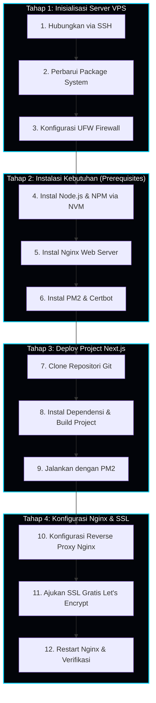

# Panduan Deployment BowPrime di Server VPS (Ubuntu)

Dokumen ini menyediakan panduan lengkap langkah-demi-langkah untuk melakukan deploy project Next.js **BowPrime** ke server Virtual Private Server (VPS) bersistem operasi **Ubuntu 20.04/22.04 LTS**.

---

## Alur Pipeline Deployment

Berikut adalah visualisasi tahapan deployment menggunakan diagram **Mermaid**:



---

## Tahap 1: Inisialisasi Server VPS

### 1. Hubungkan ke VPS via SSH
Gunakan terminal lokal Anda untuk login sebagai pengguna `root`:
```bash
ssh root@IP_ADDRESS_VPS_ANDA
```

### 2. Perbarui Package System
Lakukan pembaharuan daftar package dan upgrade paket yang terinstal untuk memastikan keamanan server:
```bash
sudo apt update && sudo apt upgrade -y
```

### 3. Konfigurasi UFW Firewall
Aktifkan firewall bawaan Ubuntu dan buka port untuk lalu lintas SSH, HTTP, dan HTTPS:
```bash
# Izinkan SSH (port 22) agar koneksi tidak terputus
sudo ufw allow OpenSSH

# Izinkan lalu lintas Nginx (HTTP port 80 & HTTPS port 443)
sudo ufw allow 'Nginx Full'

# Aktifkan Firewall
sudo ufw enable
```
*Ketik `y` saat diminta konfirmasi untuk mengaktifkan.*

---

## Tahap 2: Instalasi Kebutuhan (Prerequisites)

### 4. Instal Node.js & NPM (Menggunakan NVM)
Direkomendasikan menggunakan Node.js LTS (Versi 20 atau 22). Cara terbaik adalah menginstalnya menggunakan **NVM (Node Version Manager)**:

```bash
# Download & Jalankan Installer NVM
curl -o- https://raw.githubusercontent.com/nvm-sh/nvm/v0.39.7/install.sh | bash

# Jalankan command ini untuk mendeteksi NVM langsung di sesi SSH Anda
source ~/.bashrc

# Instal Node.js LTS terbaru
nvm install --lts

# Verifikasi instalasi Node & NPM
node -v
npm -v
```

### 5. Instal Nginx Web Server
Nginx digunakan sebagai reverse proxy untuk mengalirkan traffic internet luar (port 80/443) ke aplikasi Next.js Anda (port 3000):
```bash
sudo apt install nginx -y

# Pastikan Nginx berjalan
sudo systemctl start nginx
sudo systemctl enable nginx
```

### 6. Instal PM2 (Process Manager) & Certbot (SSL)
* **PM2** digunakan agar aplikasi Next.js tetap berjalan di *background* server bahkan setelah Anda keluar dari sesi SSH atau server melakukan restart.
* **Certbot** digunakan untuk membuat sertifikat SSL gratis (HTTPS) dari Let's Encrypt.

```bash
# Instal PM2 secara global
npm install pm2 -g

# Instal Certbot dan plugin Nginx
sudo apt install certbot python3-certbot-nginx -y
```

---

## Tahap 3: Deploy Project Next.js

### 7. Clone Repositori Git
Pindahkan direktori kerja ke `/var/www/` dan lakukan clone project BowPrime Anda dari repositori Git (misalnya GitHub/GitLab):
```bash
cd /var/www
# Ganti URL repositori dengan milik Anda
git clone https://github.com/USERNAME/bowprime.git

# Masuk ke folder project
cd bowprime
```

### 8. Instal Dependensi & Build Project
Jalankan instalasi modul dan kompilasi versi produksi Next.js:
```bash
# Instal dependensi (bersih)
npm ci --legacy-peer-deps

# Lakukan build versi produksi
npm run build
```

### 9. Jalankan dengan PM2
Gunakan PM2 untuk menjalankan script `npm run start` (port default Next.js: 3000) di background:
```bash
# Jalankan aplikasi dengan nama 'bowprime'
pm2 start npm --name "bowprime" -- start

# Konfigurasi agar PM2 otomatis menyala kembali jika server reboot
pm2 startup systemd
```
*Setelah menjalankan `pm2 startup`, salin dan jalankan (paste) command panjang yang di-generate oleh PM2 di terminal Anda.*

Terakhir, simpan konfigurasi proses aktif saat ini:
```bash
pm2 save
```

---

## Tahap 4: Konfigurasi Nginx & SSL

### 10. Buat Server Block Nginx (Reverse Proxy)
Buat file konfigurasi baru untuk domain Anda di Nginx:
```bash
sudo nano /etc/nginx/sites-available/bowprime
```

Tempelkan konfigurasi reverse proxy berikut (Ganti `domainanda.com` dan `www.domainanda.com` dengan domain asli Anda):
```nginx
server {
    listen 80;
    server_name domainanda.com www.domainanda.com;

    location / {
        proxy_pass http://localhost:3000;
        proxy_http_version 1.1;
        proxy_set_header Upgrade $http_upgrade;
        proxy_set_header Connection 'upgrade';
        proxy_set_header Host $host;
        proxy_cache_bypass $http_upgrade;
    }
}
```
*Tekan `CTRL + O`, lalu `ENTER` untuk menyimpan. Tekan `CTRL + X` untuk keluar.*

Aktifkan konfigurasi server block tersebut dengan membuat *symbolic link*:
```bash
sudo ln -s /etc/nginx/sites-available/bowprime /etc/nginx/sites-enabled/
```

Hapus konfigurasi default Nginx agar tidak tumpang tindih:
```bash
sudo rm /etc/nginx/sites-enabled/default
```

Uji apakah konfigurasi Nginx sudah benar tanpa ada kesalahan sintaksis:
```bash
sudo nginx -t
```
*Jika muncul `syntax is ok` dan `test is successful`, lanjut ke langkah berikutnya.*

### 11. Pasang SSL Let's Encrypt (HTTPS)
Jalankan Certbot untuk memperoleh SSL gratis dan mengonfigurasi Nginx secara otomatis untuk mengalihkan traffic HTTP ke HTTPS:
```bash
sudo certbot --nginx -d domainanda.com -d www.domainanda.com
```
*Ikuti petunjuk di layar (masukkan email Anda, setujui TOS, dan pilih opsi `2` untuk mengarahkan (redirect) seluruh lalu lintas otomatis ke HTTPS).*

### 12. Restart Nginx & Selesai!
Muat ulang Nginx untuk menerapkan sertifikat SSL:
```bash
sudo systemctl restart nginx
```

Buka browser Anda dan akses `https://domainanda.com`. Aplikasi **BowPrime** Anda kini aktif, aman dengan HTTPS, dan siap digunakan!

---

## Alur Pembaruan Project di Masa Depan (CI/CD Manual)
Jika Anda melakukan perubahan kode di repositori lokal dan ingin memperbarui website di VPS, masuk ke SSH lalu jalankan langkah ini:
```bash
cd /var/www/bowprime
git pull
npm install --legacy-peer-deps
npm run build
pm2 reload bowprime
```
Aplikasi Anda akan diperbarui seketika dengan **zero downtime!**
